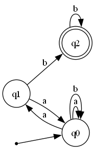
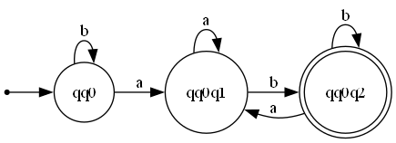

# Determinism in Finite Automata. Conversion from NDFA 2 DFA. Chomsky Hierarchy.

### Course: Formal Languages & Finite Automata
### Author: Pascari Vasile
### Variant: 23

----

## Theory
* **Finite automata** are models that recognize patterns in input strings, consisting of states, transitions, an initial state, and final states. Regular grammars define the rules for generating languages that finite automata can recognize. Each state in a finite automaton corresponds to a non-terminal in a regular grammar, with transitions representing production rules.

* A **Non-deterministic Finite Automaton (NDFA)** allows multiple transitions for the same input, while a Deterministic Finite Automaton (DFA) has only one. Converting an NDFA to a DFA, through subset construction, removes non-determinism and creates a more efficient machine suitable for tasks like lexical analysis in compilers.

* **The Chomsky hierarchy** classifies grammars into four types based on their complexity:
  * Type 3 grammars (regular) are recognized by finite automata, 
  * Type 2 grammars (context-free) by pushdown automata, 
  * Type 1 grammars (context-sensitive) by linear-bounded automata. 
  * Type 0 grammars (unrestricted) are the most general.

## Objectives:

1. Understand what an automaton is and what it can be used for.
2. Continuing the work in the same repository and the same project, the following need to be added:
   * a. Provide a function in your grammar type/class that could classify the grammar based on Chomsky hierarchy.
   * b. For this you can use the variant from the previous lab.
3. According to your variant number (9) , get the finite automaton definition and do the following tasks:
   * Implement conversion of a finite automaton to a regular grammar.
   * Determine whether your FA is deterministic or non-deterministic.
   * Implement some functionality that would convert an NDFA to a DFA.
   * Represent the finite automaton graphically (Optional, and can be considered as a bonus point)

 
## Implementation description

### Task 1:

* The **"classify_grammar"** method determines the type of a grammar based on its production rules using Chomsky classification, the rules being the following:
1. Regular grammar(type 3):
    * Right-hand side (rhs) is either a single terminal or a terminal followed by a non-terminal.
    *  If **rhs** has more than 2 symbols or does not meet these conditions, the grammar is not regular.
2. Context-free grammar(type 2):
   * Left-hand side (lhs) is a single non-terminal.
   * If **lhs** has more than 1 symbol or is not a non-terminal, it's not context-free.
3. Context-sensitive grammar(type 1):
    * Right-hand side (rhs) must be at least as long as the left-hand side (lhs).
    * If this condition isn't met, the grammar is not context-sensitive.
4. Unrestricted grammar(type 0):
    * If none of the conditions for regular, context-free, or context-sensitive hold, the grammar is unrestricted.
```
    def classify_grammar(self):
        is_regular = True
        is_context_free = True
        is_context_sensitive = True

        for lhs, rhs_list in self.P.items():
            for rhs in rhs_list:
                if len(rhs) > 2:
                    is_regular = False
                elif len(rhs) == 2:
                    if not (rhs[0] in self.VT and rhs[1] in self.VN):
                        is_regular = False
                elif len(rhs) == 1:
                    if not (rhs[0] in self.VT or rhs[0] in self.VN):
                        is_regular = False

                if len(lhs) != 1 or lhs not in self.VN:
                    is_context_free = False

                if len(rhs) < len(lhs):
                    is_context_sensitive = False

        if is_regular:
            return "Type 3 (Regular)"
        elif is_context_free:
            return "Type 2 (Context-Free)"
        elif is_context_sensitive:
            return "Type 1 (Context-Sensitive)"
        else:
            return "Type 0 (Unrestricted)"
```

### Task 2: 
The **"convert_to_regular_grammar"** converts an NDFA into a regular grammar by creating a dictionary where each state is treated as a non-terminal. If a state is a final state, it adds an ε-production, allowing the state to transition to an empty string.

For each state, it examines the NDFA’s transitions. If there’s a transition from one state to another on a given symbol, it adds a production rule in the form of "symbol next_state". 
This process effectively translates the NDFA’s behavior into a set of production rules that define the same language. The resulting dictionary maps each state to its corresponding grammar rules.

```
def convert_to_regular_grammar(ndfa):
    productions = {}
    for state in ndfa['states']:
        productions[state] = []
        if state in ndfa['final_states']:
            productions[state].append('ε')
        if state in ndfa['transitions']:
            for symbol, next_states in ndfa['transitions'][state].items():
                for next_state in next_states:
                    productions[state].append(f"{symbol}{next_state}")
    return productions
```


* The **"is_deterministic"** method checks whether the NDFA is actually deterministic. It does this by iterating through each state’s transition table and verifying that no input symbol leads to multiple possible next states.
  * If any symbol has more than one transition, the automaton is non-deterministic, and the function returns **False**.
  * If every input symbol leads to at most one next state, the automaton is deterministic, and the function returns **True**.
```
 def is_deterministic(ndfa):
    for state, trans in ndfa['transitions'].items():
        for symbol in trans:
            if len(trans[symbol]) > 1:
                return False
    return True
```

* This method converts an NDFA to a DFA using **subset construction**. Since an NDFA can transition to multiple states at once, the DFA must represent sets of states as single new states.
The way it works step-by-step is the following:
1. It starts with a **frozenset** containing the NDFA’s initial state and initializes a queue to process states iteratively.
2. For each DFA state, it examines all possible input symbols and computes the set of reachable states. If a new combination of states is found, it is added to the queue and considered a new DFA state.
3. Any DFA state that contains at least one NDFA **final state** is marked as a final state.
4. By the end, the function constructs a fully **deterministic** automaton with a well-defined transition table
```
 def convert_ndfa_to_dfa(ndfa):
    initial = frozenset({ndfa['initial_state']})
    dfa_states = {initial}
    queue = [initial]
    transitions = {}
    final_states = set()

    while queue:
        current = queue.pop(0)
        if any(s in ndfa['final_states'] for s in current):
            final_states.add(current)
        transitions[current] = {}
        for symbol in ndfa['alphabet']:
            next_states = set()
            for state in current:
                next_states.update(ndfa['transitions'].get(state, {}).get(symbol, set()))
            next_fs = frozenset(next_states)
            if next_fs not in dfa_states and next_fs:
                dfa_states.add(next_fs)
                queue.append(next_fs)
            transitions[current][symbol] = next_fs

    state_names = {}
    for i, state in enumerate(dfa_states):
        state_names[state] = f'q{"".join(sorted(state))}' if state else 'dead'

    dfa = {
        'states': [state_names[s] for s in dfa_states],
        'alphabet': list(ndfa['alphabet']),
        'initial_state': state_names[initial],
        'final_states': [state_names[s] for s in final_states],
        'transitions': {}
    }
    for state in transitions:
        dfa['transitions'][state_names[state]] = {
            sym: state_names.get(next_state, 'dead')
            for sym, next_state in transitions[state].items()
        }
    return dfa
```

* The **"draw_fa"** visualizes the finite automaton (NDFA and DFA) using Graphviz library. 
It creates a directed graph where states are represented as nodes, and transitions are edges labeled with their input symbols.
    * Final states are being drawn as **double circles**
    * Regular states as **normal circles**
    * It has a start node which indicates the initial state
    * If  transition has multiple possible next states (in NDFA), multiple edges are drawn

    At the end, it converts the graphs into png files and saves them in the directory of the code
```
    def draw_fa(fa, filename, title):
    dot = Digraph(comment=title)
    dot.attr(rankdir='LR')

    for state in fa['states']:
        if state in fa['final_states']:
            dot.node(state, shape='doublecircle')
        else:
            dot.node(state, shape='circle')

    for state, transitions in fa['transitions'].items():
        for symbol, next_state in transitions.items():
            if isinstance(next_state, set):
                for ns in next_state:
                    dot.edge(state, ns, label=symbol)
            else:
                dot.edge(state, next_state, label=symbol)

    dot.node('start', shape='point')
    dot.edge('start', fa['initial_state'])

    dot.render(filename, format='png', cleanup=True)
    print(f"{title} graph saved as '{filename}.png'")
```

## Results
``` 
Regular Grammar Productions:
q0 → aq1 | aq0 | bq0
q1 → aq0 | bq2
q2 → ε | bq2

Is Deterministic? False

DFA:
States: ['qq0q1', 'qq0', 'qq0q2']
Alphabet: ['b', 'a']
Initial State: qq0
Final States: ['qq0q2']
Transitions:
qq0 --b--> qq0
qq0 --a--> qq0q1
qq0q1 --b--> qq0q2
qq0q1 --a--> qq0q1
qq0q2 --b--> qq0q2
qq0q2 --a--> qq0q1
NDFA graph saved as 'ndfa_graph.png'
DFA graph saved as 'dfa_graph.png'
```




## Conclusion

The results show the strong connection between finite automata and regular grammars, and how converting from a non-deterministic finite automaton (NDFA) to a deterministic finite automaton (DFA) is essential for improving efficiency in tasks like compiler design and pattern matching.

The process of converting an NDFA to a regular grammar highlights how automaton states can be mapped to non-terminal symbols in a grammar, showing that regular grammars can generate regular languages that finite automata recognize. The grammar production rules generated from the NDFA directly reflect its transitions and states.

Converting an NDFA to a DFA eliminates non-determinism, ensuring a more efficient, predictable system. This is crucial for applications where speed and accuracy are needed, such as in lexical analyzers or pattern matching.

Additionally, the grammar classification function ties into the Chomsky hierarchy by classifying grammars based on their production rules, helping us understand the types of languages that finite automata can recognize. This connection reinforces the importance of formal language theory in automata-based applications like language recognition and syntax analysis.

In conclusion, these results demonstrate how automata theory is practically applied in real-world systems and emphasize the importance of understanding these concepts for optimizing tasks like language recognition and compiler design.
## References

1. _Formal Languages and Finite Automata, Guide for practical lessons_ by COJUHARI Irina, DUCA Ludmila, FIODOROV Ion.
2. _Graphviz Documentation_: https://graphviz.readthedocs.io/